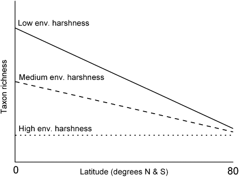

# The problem

One of the most prevalent pattern in nature is that taxonomic richness declines dramatically with increasing distance from the equator. Many hypotheses have been proposed for this. One of these is that environmental stress increases with latitude (in particular cold and natural disturbances) and that this stress filters out a large number of species that can’t tolerate such harsh conditions. Jacobson and Dangles [-@jacobsen2012] studied macroinvertebrate taxon richness in glacier-fed streams at various latitudes. They came up with a measure of environmental stress based on the influence of the glacier (‘Glacier Index’). This measure reflects that sampling sites close to large glaciers are more stressed because of colder temperatures and more frequent and larger perturbations in water flow. Jacobson and Dangles [-@jacobsen2012] predict that the slope of the relationship between richness and latitude will be less negative when environmental stress is higher because environmental stress caused by the glacier filters out many species and therefore there is no residual effect of the stress imposed by latitude.
This prediction is illustrated in their @fig-jd reproduced below.


{#fig-jd fig-align="center"}


# The data

The file `JacobsenDangles_2.csv` contains the data analyzed by @jacobsen2012. Using the data from the 65 sampling sites, we want to examine how the relationship between taxon richness (`Taxon.richness`) and latitude (`Latitude`) varies with glacier stress. `Glacier.Index` is a categorical variable indicating whether the environmental stress imposed by the glacier is low, medium, or high.

# The task

Analyze these data to test the prediction of @jacobsen2012. Your analysis must contain:

1. An explanation of how you would test the biological hypothesis above (i.e. what model terms are of interest and what follow-up tests, if any, may be needed) _(2 points)_
2. A relevant plot of the data showing the relationship between taxon and latitude separately for each level of ‘Glacier Index’. _(2 points)_
3. Some evidence (plot, test, or statement) that you examined statistical assumptions of the test you have chosen _(3 points)_
4. The statistical conclusion of your analysis. Note if you reject an interaction you should refit the model without it and report the statistical conclusions for the main effects from this simpler model. _(4 points)_
5. The “biological” conclusions, here a qualified statement about the effect of latitude, glacier-induced environment stress, and their interaction on taxon richness, including estimates of effect size, precision, and whether effects of these magnitudes seem likely to matter _(6 points)_. 
6. A statement about your confidence in the statistical conclusion (for example with respect to the violation of assumptions, to potential biases created by missing data, to suboptimal experimental design, and/or to power issues) _(2 points)_

-------------------------------------

# Report

_(3 points)_ for formatting

### Data Preprocessing

```{r}
library(ggplot2)
library(car)
library(lmtest)

jacobsen_data <- read.csv("https://raw.githubusercontent.com/nalank1/r-files/refs/heads/main/data-bioxx58/JacobsenDangles_2.csv", header = TRUE, sep = ",", stringsAsFactors = TRUE)

```

## 1. An explanation of how you would test the biological hypothesis above (i.e. what model terms are of interest and what follow-up tests, if any, may be needed) _(2 points)_

The biological hypothesis will be tested using the ANCOVA full model (broad sense) and in this lab, we are mostly examining the interaction term between Latitude (covariate) and Glacier.Index (factor). The prediction is that the slope of the relationship between Taxon.richness and Latitude will be less negative when Glacier.Index (stress) is higher. Since this hypothesis directly concerns how the effect of one variable (Latitude) changes across the levels of another (Glacier.Index), we must use an interaction model. The full model to be fitted is Taxon.richness ~ Latitude * Glacier.Index, and then, since the primary term of interest is the interaction term, we are going to test the homogeneity of slopes. If the p-value for the Latitude:Glacier.Index is significant (p < 0.05), we reject the null hypothesis of equal slopes. If the interaction is significant, then it means the slopes are heterogeneous. Since the factor (Glacier.Index) has more than two levels (low, medium, high), we need to perform follow-up tests to decide which pairs of slopes are significantly different and need to see the direction of the effect. For the follow up procedure, we can do separate comparisons for all pairs of Glacier.Index to test for the heterogeneity of slopes in each case. Then, for each significant pair, we would examine the estimated coefficients (slopes) to see if they follow the biological prediction. Since we are performing a multiple comparisons, we must control the family-wise Type I error rate (we can perform Tukey's HSD).

## 2. A relevant plot of the data showing the relationship between taxon and latitude separately for each level of ‘Glacier Index’. _(2 points)_

```{r}
jacobsen_data$Glacier.Index <- as.factor(jacobsen_data$Glacier.Index)

myplot <- ggplot(data = jacobsen_data, aes(x = Latitude, y = log10(Taxon.richness))) + 
  facet_grid(. ~Glacier.Index) + 
  geom_point()

myplot <- myplot +
  geom_smooth(method = "lm", se = FALSE) +
  labs(
    y = expression(log[10] ~ (Taxon ~ Richness)),
    x = "Latitude",
    title = expression(paste(log[10], "Taxon Richness vs. Latitude Across Glacier Stress Levels"))
  ) +
  theme_minimal()

myplot

```


## 3. Some evidence (plot, test, or statement) that you examined statistical assumptions of the test you have chosen _(3 points)_

```{r}
model_full_log <- lm(log10(Taxon.richness + 1) ~ Latitude * Glacier.Index, data = jacobsen_data)

Anova(model_full_log, type = 3)
summary(model_full_log)
```

```{r}
par(mfrow = c(2,2))
plot(model_full_log)
```

```{r}
shapiro.test(residuals(model_full_log))
```

```{r}
bptest(model_full_log)
```

```{r}
resettest(model_full_log, power = 2:3, type = "regressor")
```

We first applied linear model as it was displayed in the R-way to Hell book; however, we found that normality was violated. Therefore, we decided to apply log10 function to Taxon.richness; however, after that, there was an error with the log10 as log10(0) is undefined, ending up putting log10(Taxon.richness + 1). <br>

As seen in the QQ Plot, the data seems to be validating the normality assumption (although there are some deviation at the ends), and with the Shapiro Test (W = 0.98532, p = 0.6565), the normality assumption was met. The Residuals vs. Fitted plot is showing the data to be homoscedastic. Since p-value (p = 0.05914) in BP Test is greater than 0.05, we fail to reject the null hypothesis which was the variance of the residuals is homoscedastic. In addition to that, by looking at Residuals vs Leverage and Cook's distance, we can see there is no outliers influencing the model. However, with p-value resulting in 4.98e-06 in reset test, we reject the null hypothesis which is the model has the correct linear form. It seems that the model needs higher order terms, and log10 transformation is not enough. <br>
In our biological hypothesis, we predicted that there is a significant interaction between Latitude and Glacier.Index, meaning the rate of decline in taxon richness should vary acros the three stress levels. This prediction is labelled as Alternative Hypothesis. However, the p-value for the interaction term (Latitude:Glacier.Index) was 0.50. Since the value is much greater than the standard significance level (0.05), we fail to reject the null hypothesis, indicating there is no statistically significant evidence that slopes across three levels differ. In other words, the slopes across the three stress levels don't differ. 

## 4. The statistical conclusion of your analysis. Note if you reject an interaction you should refit the model without it and report the statistical conclusions for the main effects from this simpler model. _(4 points)_

We first fitted the full model (broad sense) with an interaction between the covariate (Latitude) and the factor (Glacier.Index) using log10(Taxon.richness + 1) transformed response variable. Since the p-value (0.5049762) is much greater than the significance level (0.05), we fail to reject the null hypothesis. We conclude that the slopes of the regression lines describing the relationship between log10(Taxon.richness + 1) and Latitude don't significantly differ across the three levels of Glacier.Index. Therefore, the data doesn't support the biological hypothesis, and the assumption of homogeneous slopes was valid. <br>
After that, we removed the non-significant interaction term and the model was refitted as a traditional ANCOVA. The main effect of Latitude was found to be no statistically significant (p = 0.5202). This indicates that, the average change in log10(Taxon.richness + 1) across the range of Latitude is negligible. The main effect of Glacier.Index was found highly statistically significant (p-value = 1.904e-10). This means that even though the slopes are parallel, the log10(Taxon.richness + 1) differs significantly between the three levels. In addition to that, the low stress group has a significantly higher adjusted mean richness (0.6473442). Overall, the ANCOVA displayed that Glacier.Index is a highly significant predictor of taxon richness. 


```{r}
model.ancova <- lm(log10(Taxon.richness + 1) ~ Latitude + Glacier.Index, data = jacobsen_data)
Anova(model.ancova)
summary(model.ancova)
```

## 5. The “biological” conclusions, here a qualified statement about the effect of latitude, glacier-induced environment stress, and their interaction on taxon richness, including estimates of effect size, precision, and whether effects of these magnitudes seem likely to matter _(6 points)_. 

The biological hypothesis predicted that the relationship between latitude and richness would change depending on the lvel of the environmental stress. However, the statistical analysis didn't support this. In the full interaction model, the interaction terms were almost zero. The high stress slope (reference) is found to be 0.0003880 (+/- 0.0021), the medium stress slope is around -0.0023299 (Latitude + Latitude:Glacier.Indexmedium), and the low stress slope is around 0.0010 0.0010347. In all cases, the standard errors were larger than the coefficient estimates, indicating that we can't define a non-zero slope with confidence. Based on the simplified ANCOVA model, there is a clear biological gradient where richness decreases as stress increases. We were able to estimate the magnitude of the effect by back transforming the model coefficients to predict the central tendency of species count (Richness = 10^coefficient - 1). The coefficient for the low group represents an increase of 0.647 so ((10^0.678 + 0.647) - 1) means 20.1 species, the medium level had a coefficient of 0.330 so ((10^0.678 + 0.330) - 1) results in 9.2 species per site, and the high stress is all about the intercept so (10^0.678) - 1 results in 3.8 species per site. The effect size is massive, and reducing environmental stress from high to low results in approximate 5-fold increase in species richness (from 4 to 20 species). Therefore, this effect is biologically significant. <br> However, latitude has no statistical or biologically significant effect on taxon richness (p = 0.52). Over the entire studied range of approximately 80 degrees of latitude, this model predicts a total decrease in richness of only 0.065 log units. In biological terms, this accounts for a change of less than 1 species across the entire hemisphere. In addition to that, the interaction between Latitude and Stress is not biologically significant since the estimated changes in slopes were small and negligible.

<br>
For your information on how we calculated the species per site: <br>
Medium Stress: Y = Intercept + Medium Coefficient = 0.678 + 0.330
Low Stress: Y = Intercept + Low Coefficient = 0.678 + 0.647

## 6. A statement about your confidence in the statistical conclusion (for example with respect to the violation of assumptions, to potential biases created by missing data, to suboptimal experimental design, and/or to power issues) _(2 points)_

Our confidence in the final statistical conclusion is high. This confidence is supported by several factors. The initial violation of the normality assumption was successfully rectified by transforming the response variable to log10(Taxon.richness + 1), making sure that the core assumptions of ANCOVA are met and that the reported p-values are reliable. Furthermore, the decision to remove the non-significant interaction term (p = 0.5049762) led to the final (model.ancova), which increases the statistical power and interpretability of the main effects. Homogeneity of the variance model assumption was met and verified by bp test. The main effect of Glacier.Index was extremely significant (p = 1.904e-10) and demonstrated a large biological magnitude (a 5-fold difference in richness). However, our confidence is slightly tempered by acknowledged limitations. Firstly, the initial violation of the functional form assumption (RESET test p = 4.98e-6) suggests the linear model is not perfect, and a quadratic term might better capture the relationship. Secondly, although the main effect ofLatitude was biologically negligible (slope  -0.0008 log units) and statistically non-significant (p = 0.52). Overall, there is a possibility that the strong effect contributed to Glacier.Index may be caused by the other environmental factors. 

-------------------------------------

# References

- BioStats UOttawa. (n.d.). ANCOVA and the General Linear Model. Retrieved November 26, 2025, from https://biostats-uottawa.github.io/Rway/36-ancova_glm.html#ancova


- Datanovia. (n.d.). ANCOVA in R: Analysis of covariance - Easy Guides. Retrieved November 26, 2025, from https://www.datanovia.com/en/lessons/ancova-in-r/


- QCBS R Workshop. (n.d.). Analysis of covariance (ANCOVA). Retrieved November 26, 2025, from https://r.qcbs.ca/workshop04/book-en/analysis-of-covariance-ancova.html